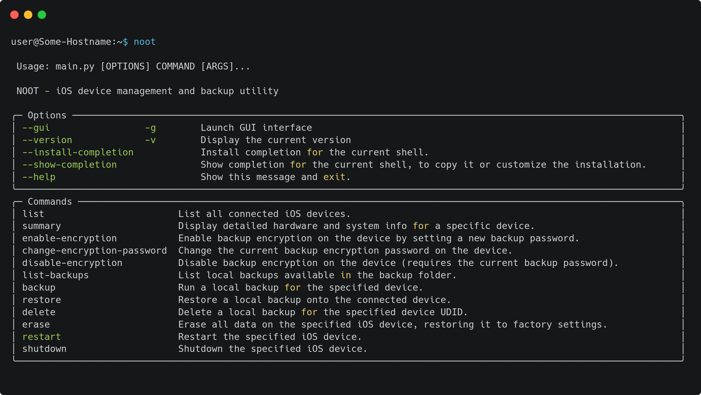

<div align="center">

  <!-- Stato Avanzamento Moduli -->
  
  

  <br/>

  <!-- Stack Tecnologico -->
  
  

  <br/>

  <!-- Target & Compatibilità -->
  
  

</div>

# Noot (Non-apple Open-source Operator for iTunes)

iPhone backup manager for Linux, built using pymobiledevice3 module.

## Requirements

If you are using noot from source, you need to have the following dependencies installed:

- Python 3.6+
- libusb-1.0-0
- usbmuxd
- every Python module listed in `requirements.txt` (can be installed using `pip install -r requirements.txt`)

Otherwise, if you have downloaded the AppImage or the release, and installed with the `install.sh` script, you don't need to install any dependencies, as they are already included.

## Installation

### From Release

You can do this by running the provided `install.sh` script:

1. Download the latest release from the [releases page](https://github.com/SamuGallo-06/noot/releases).
2. Extract the downloaded archive.
3. Open a terminal in the extracted folder and run the following commands:

```bash
chmod +x install.sh
sudo ./install.sh
```

The script will install the required dependencies and pyhton modules, and enable the usbmuxd service.

## Command Line

The software can be used from the command line. To see the available commands, run:

```bash
noot --help
```

This will display a list of available commands and their usage


